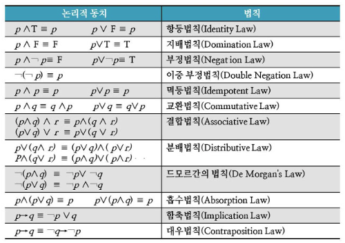

### 동치
- 어떤 것이 어떤것과 같다는 의미
- 같은 의미를 가진 더 쉬운 명제를 발견하는데 사용된다.

#### 동치법칙

- 출처: http://junhpgh.blogspot.com/2012/04/logical-equivalence-p-q.html

#### 예시
Q. $(p \rightarrow q) \wedge (p \rightarrow ¬q )$ 를 간소화 하라 
$\Leftrightarrow (¬p \vee q) \wedge (¬p \vee ¬q)$ : `함축법칙` 
$\Leftrightarrow ¬p \vee (q \wedge ¬q)$ : `분배법칙` 
$\Leftrightarrow ¬p \vee F$ : `부정법칙` 
$\Leftrightarrow ¬p$ : `항등법칙`

Q. 다음 합성명제를 증명하라  
$¬(p \vee ¬q) \wedge (¬p \wedge ¬q) \equiv ¬p$ 
$\Leftrightarrow (¬p \wedge q) \vee (¬p \wedge ¬q)$ : `드모르간 법칙` 
$\Leftrightarrow vp \wedge (q \vee ¬q)$ : `분배법칙` 
$\Leftrightarrow ¬p \wedge T$ : `부정법칙` 
$\Leftrightarrow ¬p$ : `항등법칙` 